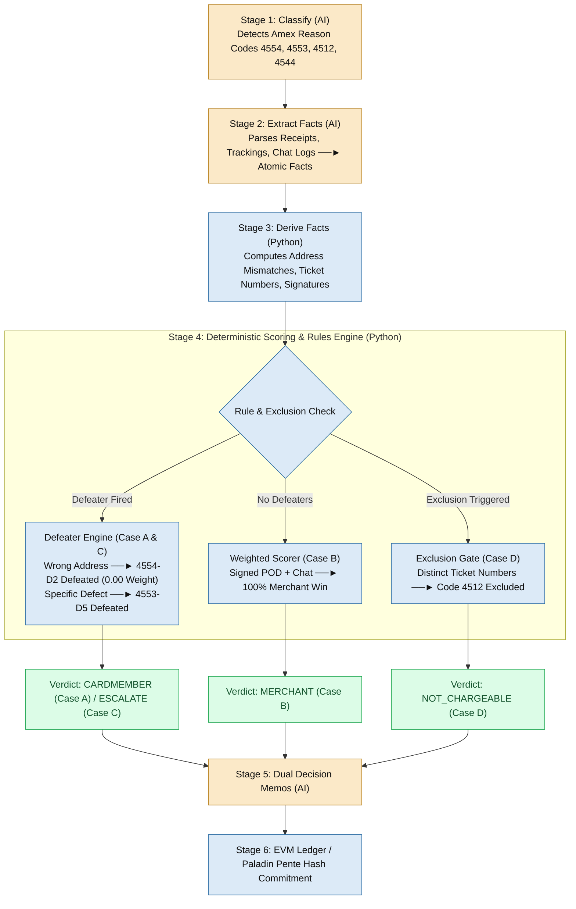
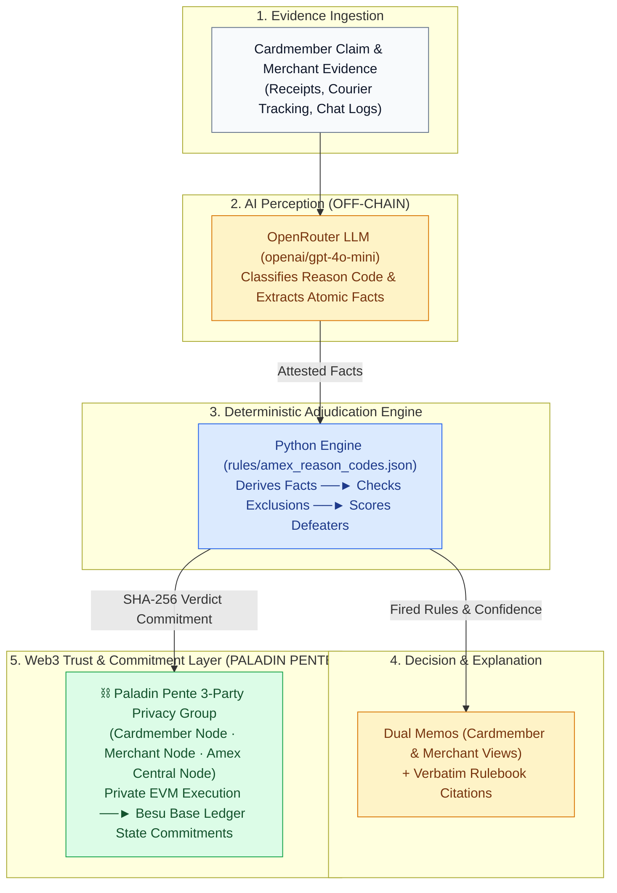

# Verdict Chain — Pitch Deck Specification

> **Round 1 Hackathon Presentation**  
> *Frictionless Dispute & Chargeback Resolution*  
> *Independent student project, not affiliated with American Express*

---

## Slide 1 — Title / The Hook

### **Verdict Chain — dispute resolution in seconds, provable to both sides**

> **The AI never decides anything. It only reads. American Express's own rulebook decides — and the chain proves nobody changed the answer.**

An AI adjudicator with a tamper-evident reasoning ledger, built on American Express's published chargeback reason codes.

- **Speed:** 30–90 days $\rightarrow$ 17–27 seconds measured
- **Cost:** $9.08–$10.32 issuer cost per dispute $\rightarrow$ cents of compute
- **Trust:** Every decision cited, hashed, and identical for Card Member and merchant

```
┌─────────────────────────────────────────────────────────────┐
│ 🖥️ PROOF OF BUILD: Live React SPA + FastAPI + EVM Devnet   │
│ Stream: Classified (4554) ──► Facts (14) ──► Mined Tx Hash │
└─────────────────────────────────────────────────────────────┘
```

*Frictionless Dispute & Chargeback Resolution | Team Verdict Chain*

---

## Slide 2 — The Problem

### **Disputes are slow, opaque, and unfair to whoever has less time to fight**

- **Slow:** A chargeback takes 30–90 days (75–120 days for complex cases). Merchants finance the reversal for months. *(Source: Chargebacks911, 2025)*
- **Expensive:** Each transaction costs financial institutions **$9.08–$10.32** to process. FIs hire 1 FTE per **$13,000–$14,000** of annual disputes. All-in merchant cost averages **$110 per dispute**. *(Source: Mastercard / Datos Insights, 2025)*
- **Opaque:** Representment win rate averages **20%** — outcomes track evidence-submission capacity, not merits. *(Source: Chargebacks911, 2025)*

**Market Scale:** **261M** chargebacks in 2025 $\rightarrow$ **324M** by 2028. Financial impact: **$36.9B in 2026** $\rightarrow$ **$46.1B in 2029**. *(Source: Mastercard / Datos Insights, 2025)*

---

## Slide 3 — Why This Is Hard

### **The obvious fix — "let AI decide" — fails the trust test**

1. **Adversarial parties:** Card Member and merchant both distrust the referee. An unexplained AI verdict is less acceptable than a slow human one.
2. **Unstructured & Contradictory Evidence:** Receipts, tracking records, chat logs, policy pages — arriving as text and images, not neat fields.
3. **Strict Compliance Requirement:** Decisions must be defensible against 24 published network reason codes, not a black-box model's opinion.

*The problem isn't automation. It's automation someone will accept.*

---

## Slide 4 — Our Solution

### **AI reads the evidence. The Amex rulebook decides. The ledger proves it.**

Verdict Chain ingests a disputed charge, parses evidence into structured facts carrying source provenance, applies deterministic rules encoded from American Express's published chargeback guide, renders a verdict with a plain-language memo, and commits a hash of every step to an EVM ledger.

### Five Core Pillars:
- **Triage Before Adjudication (Roadmap):** Pre-adjudication routing to merchant remedy where one exists.
- **Auto-Gather & Parse:** Evidence $\rightarrow$ structured facts with source span provenance.
- **Fair Weighing:** Rules from the Amex guide, weighted, with defeater logic.
- **Transparent Reasoning:** Memo cites fact IDs and verbatim rulebook text.
- **Web3 Provable Trail:** Paladin Pente privacy group execution; state commitments published on-chain.

*Separation of Powers — The AI never decides anything. It only reads.*

---

## Slide 5 — How It Works (Pipeline Flow)

### **Six operational stages, 17–27 seconds, four distinct outcome branches**



### Worked Narrative Example:
> The merchant submitted a delivery confirmation stating **DELIVERED** to #41 Marlowe St instead of order shipping address #14 Marlowe St.  
> Our engine suppresses the merchant's defense entirely — because delivery to the wrong address cannot satisfy a rule requiring delivery to the specified address.  
> **Reason code 4554 · defense 4554-D2 defeated · verdict: Card Member · confidence 60.0% · full resolution 20.4 seconds.**

---

## Slide 6 — Architecture

### **Four layers, featuring Paladin Web3 Privacy Integration**



*Paladin is a Linux Foundation Decentralized Trust project already deployed by central banks, commercial banks, and financial institutions.*

---

## Slide 7 — The Fair-Weighing Model

### **Encoded from Amex's published reason codes — not invented**

- **Reason Code 4554 (Non-Receipt):** Merchant defense `4554-D2` (Proof of Delivery) weighted at −0.90; Cardmember condition `4554-C2` (Address Mismatch) weighted at +0.90.
- **Defeater Logic:** If `delivery_address_mismatch` is True, defense `4554-D2` is **suppressed to weight 0.00** (DEFEATED).
- **Exclusion Logic (Reason Code 4512):** Exclusions execute prior to scoring. Distinct ticket numbers trigger exclusion `4512-X1` $\rightarrow$ `NOT_CHARGEABLE_UNDER_CODE`.
- **Normalized Confidence:** $\text{Confidence} = \frac{|\text{Raw Score}|}{\sum |\text{All Applicable Weights Including Defeated}|}$

*Weights are our calibration; conditions and requirement text come verbatim from the Amex guide. The engine is market-configurable — one rules file per market.*

---

## Slide 8 — Transparency & Web3 Trust

### **Paladin Pente 3-Party Privacy Groups — Confidential, Provable Settlement**

*Dispute data can never go on a public chain — so it doesn't.*

- **🔒 Confidential Off-Chain Perception:** Raw evidence (receipts, tracking logs) stays off-chain between parties. Personal data is never published on-chain.
- **⛓ Paladin Pente 3-Party Privacy Group:** Adjudication smart contracts execute in a Pente private EVM group shared exclusively by three nodes: **Cardmember Node, Merchant Node, and Amex Central Node**.
- **📜 Base Ledger Commitments:** Only SHA-256 state commitments reach the base ledger (Hyperledger Besu / EVM), giving both parties an immutable, tamper-evident audit receipt.

*Today: Hash commitments mined to an EVM devnet ledger (Anvil RPC port 8545), verifiable by transaction receipt. Paladin Pente 3-node deployment is the first item on our August roadmap.*

---

## Slide 9 — Working Prototype

### **Four dispute scenarios, four distinct outcomes, end to end**

- **Card Member Wins (Case A):** *"One transposed digit in a delivery address — caught by the derivation step, whole case resolved in 20.4 seconds."*
- **Merchant Wins (Case B):** *"Same reason code, same rules, same weights. Signed delivery to correct address + customer acknowledged receipt in chat."*
- **Escalated (Case C):** *"Confidence 17.8%. System refuses to rule and routes to a human — with case file pre-assembled."*
- **Not Chargeable (Case D):** *"Same amount, merchant, date. Guide excludes airline tickets with different ticket numbers — engine rules not chargeable under code 4512."*

```
┌─────────────────────────────────────────────────────────────────────────────┐
│ 📸 UI SCREENSHOTS (React SPA Stream + Mined Transaction Hash)               │
│ [Case A: Cardmember 60%] | [Case B: Merchant 100%]                       │
│ [Case C: Escalated 17.8%] | [Case D: Not Chargeable 100%]                   │
└─────────────────────────────────────────────────────────────────────────────┘
```

> **Demo Video:** `https://github.com/sogalabhi/amex-prototype`  
> **Repository:** `https://github.com/sogalabhi/amex-prototype`  
> **Sample Mined Tx Hash:** `0x57813dec4910a1045c6f859eae653f1313acbd136d977f821a7bd3e1fdd9aaaf`

*Four cases. Four different outcome types: Card Member, merchant, escalation, not chargeable. One engine, one rulebook.*

---

## Slide 10 — Deep Dive: The Airline Non-Duplicate Exclusion (Case D)

### **How the engine enforces explicit rulebook exclusions on identical charges**

- **The Scenario:** Two identical charges of AUD 1,890.00 from Kestrel Airways 40 minutes apart. Cardmember files dispute as Reason Code 4512 (Multiple Processing / Duplicate).
- **The Rulebook Gate:** Amex Reason Code 4512 explicitly excludes *"Airline tickets with different ticket numbers"*.
- **The Execution:** Extraction identifies ticket `081-2244551903` and ticket `081-2244551904` (both flown). Derivation fires `distinct_ticket_numbers`.
- **The Outcome:** Exclusion `4512-X1` triggers prior to scoring $\rightarrow$ Verdict: **NOT_CHARGEABLE_UNDER_CODE**.
  > *"Same amount, same merchant, same day. Every duplicate-detection heuristic flags this. But the guide excludes airline tickets with different ticket numbers — and there are two ticket numbers here, both flown. The system doesn't rule against the Card Member; it rules that this dispute cannot be raised under this code at all."*

---

## Slide 11 — Success Metrics & Verified Benchmark Matrix

### **Measured performance across authored ground truth test cases**

| Case ID | Category / Scenario | Verified Result | Time & Conf. | Key Rule Mechanics Fired |
|---|---|---|---|---|
| **CASE A** | Non-Receipt (Address Mismatch) | **CARDMEMBER** | 20.4s (60.0%) | `4554-D2` (−0.90) **DEFEATED** by address mismatch; `4554-C2` & `C3` active. |
| **CASE B** | Non-Receipt (Signed POD + Chat) | **MERCHANT** | 17.8s (100.0%) | `4554-D1`, `D2`, `D5` active. 100% evidence balance. |
| **CASE C** | Defective Merchandise (Timber/Seam) | **ESCALATE_HUMAN** | 23.6s (17.8%) | `4553-D1` & `D5` **DEFEATED** by defect claim. Raw score +0.65, conf 17.8% < 50% cutoff. |
| **CASE D** | Multiple Processing (Airline Tickets) | **NOT_CHARGEABLE** | 27.3s (100.0%) | Exclusion `4512-X1` triggered by `distinct_ticket_numbers`. Short-circuits scoring. |

*Four cases. Four different outcome types: Card Member, merchant, escalation, not chargeable. Measured resolution time: 17–27 seconds. 100% agreement (4/4) evaluated against authored ground truth with inter-case consistency checks.*

---

## Slide 12 — Not Every Dispute Should Be a Dispute (Stage 0 Triage)

### **The cheapest dispute to resolve is the one that never becomes a chargeback**

- **Friendly Fraud Scale:** Nearly **79%** of 2025 disputes were friendly fraud — valid purchases reversed instead of a refund request. First-party fraud accounts for **36%** of all global fraud cases. *(Sources: Chargebacks911, 2025; Merchant Risk Council)*
- **Stage 0 Pre-Dispute Triage (Roadmap):** Stage 0 routes eligible claims back to merchant remedy before formal adjudication — designed and scheduled for the prototype round.
- **Economic Impact:** Every dispute diverted at Stage 0 avoids the full $9–$10 issuer processing cost and the ~$110 all-in merchant cost — before a single AI call is made.

---

## Slide 13 — Business Impact

### **Why American Express is uniquely positioned to ship this**

- **For Card Members:** Instant resolution, complete transparency into evidence evaluated.
- **For Merchants:** Today the average representment win rate is **20%** — outcomes track who can afford a disputes team, not who's right. Evidence-based adjudication against published rules removes that asymmetry.
- **For American Express:** Direct cost reduction against **$9.08–$10.32** per dispute and **200+** back-office staff per FI, with that capacity redeployed to genuinely complex cases.
- **The Amex Closed-Loop Advantage:**
  > **American Express is issuer, network, and acquirer in one closed loop. Every other issuer would need three parties to agree before a system like this could settle a dispute end to end. Amex doesn't. This is deployable here in a way it isn't anywhere else.**

---

## Slide 14 — Assumptions, Constraints & Scalability

### **Technical requirements, system boundaries, and growth vector**

- **Assumptions:** Issuer can expose transaction/order metadata via API connectors; merchants submit evidence digitally; published reason codes remain governing standard; disputes are already filed (fraud detection out of scope).
- **Constraints:** Rules encoded from Amex AU guide (market-configurable per region); network rules govern open rail settlement; low-confidence cases require human adjudication; prototype runs on authored cases.
- **Scalability:**
  - *Technical:* Stateless FastAPI services scale horizontally, extraction parallelizes per document, ledger commitments are per-dispute.
  - *Economic:* Marginal cost per adjudication is cents of compute against $9–$10 manual processing.
  - *Scope:* Architecture extends to billing errors, benefit claims, and travel disputes.

---

## Slide 15 — Implementation Roadmap & Wireframes

### **From Round 1 submission to enterprise finale deployment**

- **Phase 1 (Round 1 Submission):** Working FastAPI backend, OpenRouter LLM pipeline (`openai/gpt-4o-mini`), deterministic scoring engine, EVM devnet hash commitments (`eth_sendTransaction`), React SPA frontend.
- **Phase 2 (Aug 7–21 Finale):** Full 24 Amex reason code coverage, 3-party Paladin Pente privacy group integration, Cardmember/Merchant portals, 50-case benchmark evaluation suite.
- **Phase 3 (Enterprise Scale):** Integration with Amex closed-loop authorization feed and automated merchant API connectors.

```
┌─────────────────────────────────────────────────────────────────────────────┐
│ 📐 FINALE PORTAL WIREFRAMES                                                  │
│ [Cardmember Portal: File Claim / Track Live SSE Stream / View Memo]          │
│ [Merchant Portal: Chargeback Alerts / Upload Invoices & PODs / Pre-Score]  │
└─────────────────────────────────────────────────────────────────────────────┘
```

---

## Slide 16 — Conclusion

### **Built on the rulebook, proven in code, honest about what's next**

> **Fast, fair, and provable — the problem statement's three words. We didn't argue for them; we ran four disputes end to end and showed you all four.**

---

## Appendix — Sources & References

- **Mastercard / Datos Insights**, *Global Chargeback Volume and Cost Study*, 2025 — volumes, issuer processing cost, FTE ratios, merchant all-in cost.
- **Chargebacks911**, *Chargeback Field Report*, 2025 — resolution timelines, representment win rate, friendly fraud share.
- **Merchant Risk Council**, *First-Party Fraud Global Report* — 36% first-party fraud share.
- **American Express**, *Chargeback Code Guide* (AU merchant edition) — reason codes 4554, 4553, 4512, 4544; dispute and response windows.
- **Linux Foundation Decentralized Trust**, *Paladin project documentation*.
