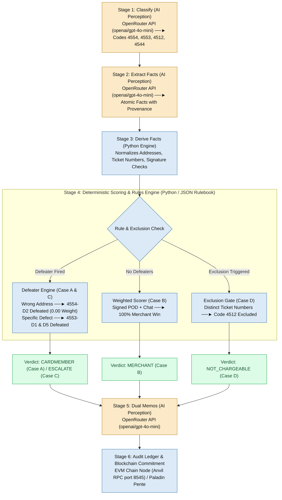

# Verdict Chain — Pitch Deck Specification

> **Round 1 Hackathon Presentation**  
> *Frictionless Dispute & Chargeback Resolution*  
> *Independent student project, not affiliated with American Express*

---

## Slide 1 — Title & Proof of Build

### **Verdict Chain — dispute resolution in seconds, provable to both sides**

> **The AI never decides anything. It only reads. American Express's own rulebook decides — and the chain proves nobody changed the answer.**

An AI adjudicator with a tamper-evident reasoning ledger, built on American Express's published chargeback reason codes.

- **Speed:** 30–90 days $\rightarrow$ 17–27 seconds measured across four dispute cases
- **Cost:** $9.08–$10.32 issuer cost per dispute $\rightarrow$ cents of compute
- **Trust:** Every decision cited, hashed, and identical for Card Member and merchant

```
┌────────────────────────────────────────────────────────────────────────────┐
│ 🖥️ PROOF OF BUILD: Live React SPA + FastAPI + EVM Devnet (Anvil RPC 8545) │
│ Pipeline Stream: Classified ──► Extracted ──► Scored ──► Mined Tx Hash     │
└────────────────────────────────────────────────────────────────────────────┘
```

> **Demo Video:** `https://github.com/sogalabhi/amex-prototype` | **Repository:** `https://github.com/sogalabhi/amex-prototype`  
> **Sample Mined Tx Hash:** `0x57813dec4910a1045c6f859eae653f1313acbd136d977f821a7bd3e1fdd9aaaf`

*Frictionless Dispute & Chargeback Resolution | Team Verdict Chain*

---

## Slide 2 — The Problem & Friendly Fraud Scale

### **Disputes are slow, expensive, and opaque — driven by massive friendly fraud**

- **Friendly Fraud Scale:** Nearly **79%** of 2025 disputes were friendly fraud — valid purchases reversed instead of requesting a refund. **1 in 5 consumers** admit to committing friendly fraud, and first-party fraud now accounts for **36%** of all global fraud cases, more than doubling in a single year. *(Sources: Chargebacks911, 2025; Merchant Risk Council)*
- **Slow & Expensive:** Disputes take **30–90 days** (75–120 for complex cases). FIs spend **$9.08–$10.32** per dispute in ops labor, hiring 1 FTE per **$13,000–$14,000** of annual disputes. Merchant all-in cost averages **$110 per dispute**. *(Source: Mastercard / Datos Insights, 2025)*
- **Opaque Outcomes:** Merchant representment win rate averages **20%** — outcomes track evidence-submission capacity, not merits. *(Source: Chargebacks911, 2025)*
- **Market Scale:** **261M** chargebacks in 2025 $\rightarrow$ **324M** by 2028. Total financial impact growing from **$36.9B in 2026** to **$46.1B in 2029**. *(Source: Mastercard / Datos Insights, 2025)*

---

## Slide 3 — Our Solution

### **AI reads the evidence. The Amex rulebook decides. The ledger proves it.**

Verdict Chain ingests a disputed charge, parses evidence into structured facts carrying source provenance, applies deterministic rules encoded from American Express's published chargeback guide, renders a verdict with a plain-language memo, and commits a hash of every step to an EVM ledger.

### Five Core Pillars:
- **Stage 0 Pre-Dispute Triage (Roadmap):** Diverts friendly fraud before formal adjudication by routing eligible claims back to merchant remedy (return window, store credit, replacement) — saving $9–$10 issuer cost before a single AI call is made.
- **Auto-Gather & Parse:** Evidence $\rightarrow$ structured facts with source span provenance.
- **Fair Weighing:** Rules from the Amex guide, weighted, with defeater logic.
- **Transparent Reasoning:** Dual decision memos cite fact IDs and verbatim rulebook text.
- **Web3 Provable Trail:** Paladin Pente privacy group execution; state commitments published on-chain.

*Separation of Powers — The AI never decides anything. It only reads.*

---

## Slide 4 — How It Works (Unified Pipeline Architecture)

### **Six operational stages, tech-stack component labeling, four case branches**



---

## Slide 5 — The Fair-Weighing Model

### **Encoded from Amex's published reason codes — not invented**

- **Reason Code 4554 (Non-Receipt):** Merchant defense `4554-D2` (Proof of Delivery) weighted at −0.90; Cardmember condition `4554-C2` (Address Mismatch) weighted at +0.90.
- **Defeater Logic:** If `delivery_address_mismatch` is True, defense `4554-D2` is **suppressed to weight 0.00** (DEFEATED).
- **Exclusion Logic (Reason Code 4512):** Exclusions execute prior to scoring. Distinct ticket numbers trigger exclusion `4512-X1` $\rightarrow$ `NOT_CHARGEABLE_UNDER_CODE`.
- **Normalized Confidence:** $\text{Confidence} = \frac{|\text{Raw Score}|}{\sum |\text{All Applicable Weights Including Defeated}|}$
  - *Confidence reflects the share of applicable evidence supporting the verdict — here, all of it (Case B = 100%).*

*Weights are our calibration; conditions and requirement text come verbatim from the Amex guide. The engine is market-configurable — one rules file per market.*

---

## Slide 6 — Trust & Web3 Privacy Architecture

### **Paladin Pente 3-Party Privacy Groups — Confidential, Provable Settlement**

*Dispute data can never go on a public chain — so it doesn't.*

- **🔒 Confidential Off-Chain Perception:** Raw evidence (receipts, tracking logs) stays off-chain between parties. Personal data is never published on-chain.
- **⛓ Paladin Pente 3-Party Privacy Group:** Adjudication smart contracts execute in a Pente private EVM group shared exclusively by three nodes: **Cardmember Node, Merchant Node, and Amex Central Node**.
- **📜 Base Ledger Commitments:** Only SHA-256 state commitments reach the base ledger (Hyperledger Besu / EVM), giving both parties an immutable, tamper-evident audit receipt.

*Today: Hash commitments mined to an EVM devnet ledger (Anvil RPC port 8545), verifiable by transaction receipt. Paladin Pente 3-node deployment is the first item on our August roadmap.*

---

## Slide 7 — Measured Results & Benchmark Matrix

### **100% ground truth agreement (4/4) across four distinct outcome types**

| Case ID | Category / Scenario | Verified Outcome | Time & Conf. | Key Rule Mechanics Fired |
|---|---|---|---|---|
| **CASE A** | Goods Not Received (Address Mismatch) | **CARDMEMBER** | 20.4s (60.0%) | `4554-D2` (−0.90) **DEFEATED** by address mismatch; `4554-C2` & `C3` active. |
| **CASE B** | Goods Not Received (Signed POD + Chat) | **MERCHANT** | 17.8s (100.0%) | `4554-D1`, `D2`, `D5` active. 100% evidence balance. |
| **CASE C** | Defective Merchandise (Timber/Seam) | **ESCALATE_HUMAN** | 23.6s (17.8%) | `4553-D1` & `D5` **DEFEATED** by defect claim. Raw score +0.65, conf 17.8% < 50% cutoff $\rightarrow$ escalate. |
| **CASE D** | Multiple Processing (Airline Tickets) | **NOT_CHARGEABLE** | 27.3s (100.0%) | Exclusion `4512-X1` triggered by `distinct_ticket_numbers`. Short-circuits scoring. |

*Note on Case C: When confidence falls below the 50% threshold (17.8%), the system refuses to rule and routes to a human reviewer with the case file pre-assembled. Automation that knows its limits is the only kind a regulated FI can deploy.*

---

## Slide 8 — Business Impact

### **Why American Express is uniquely positioned to ship this**

- **For Card Members:** Instant 20-second resolution, complete transparency into evidence evaluated.
- **For Merchants:** Today the average representment win rate is **20%** — outcomes track who can afford a disputes team, not who's right. Evidence-based adjudication against published rules removes that asymmetry.
- **For American Express:** Direct cost reduction against **$9.08–$10.32** per dispute and **200+** back-office staff per FI, with that capacity redeployed to genuinely complex cases.
- **The Amex Closed-Loop Advantage:**
  > **American Express is issuer, network, and acquirer in one closed loop. Every other issuer would need three parties to agree before a system like this could settle a dispute end to end. Amex doesn't. This is deployable here in a way it isn't anywhere else.**

---

## Slide 9 — Scope, Constraints & Implementation Roadmap

### **System boundaries today, growth vectors for August finale**

| Assumptions & Constraints | Implementation & Expansion Roadmap |
|---|---|
| **Assumptions:** Issuer exposes order metadata via API connectors; merchants submit evidence digitally; published reason codes govern; disputes already filed (fraud detection out of scope). | **Phase 1 (Round 1 Submission):** Working FastAPI backend, OpenRouter LLM (`openai/gpt-4o-mini`), Python scoring engine, EVM devnet hash commitments (`eth_sendTransaction`), React SPA frontend. |
| **Constraints:** Rules encoded from Amex AU guide (market-configurable per region); network rules govern open rail settlement; low-confidence cases require human adjudication; prototype runs on authored cases. | **Phase 2 (Aug 7–21 Finale):** Full 24 Amex reason code coverage, 3-party Paladin Pente privacy group integration, Stage 0 pre-dispute triage, Cardmember/Merchant portals, 50-case benchmark suite. |
| **Scalability:** Stateless FastAPI scales horizontally; extraction parallelizes per document; ledger commitments are per-dispute; architecture extends to billing/travel disputes. | **Phase 3 (Enterprise Scale):** Integration with Amex closed-loop authorization feed and automated merchant API connectors (Shopify, Stripe, FedEx). |

---

## Slide 10 — Conclusion

### **Built on the rulebook, proven in code, honest about what's next**

> **Fast, fair, and provable — the problem statement's three words. We didn't argue for them; we ran four disputes end to end and showed you all four.**

---

## Appendix — Sources & References

- **Mastercard / Datos Insights**, *Global Chargeback Volume and Cost Study*, 2025 — volumes, issuer processing cost, FTE ratios, merchant all-in cost.
- **Chargebacks911**, *Chargeback Field Report*, 2025 — resolution timelines, representment win rate, friendly fraud share.
- **Merchant Risk Council**, *First-Party Fraud Global Report* — 36% first-party fraud share.
- **American Express**, *Chargeback Code Guide* (AU merchant edition) — reason codes 4554, 4553, 4512, 4544; dispute and response windows.
- **Linux Foundation Decentralized Trust**, *Paladin project documentation*.
